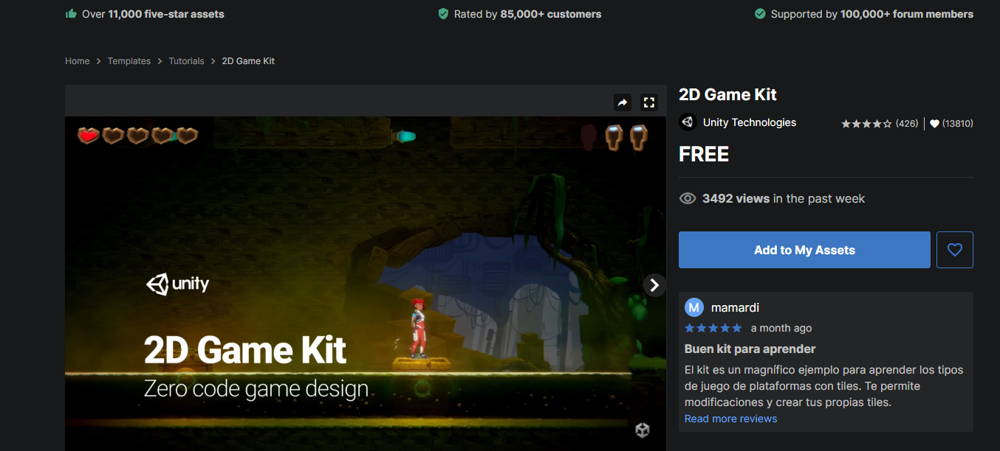
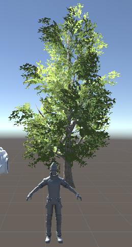
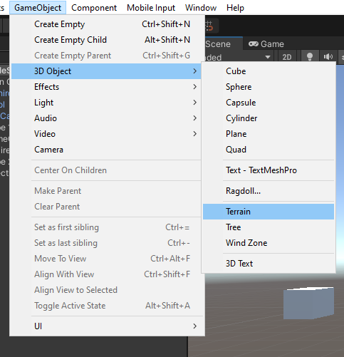
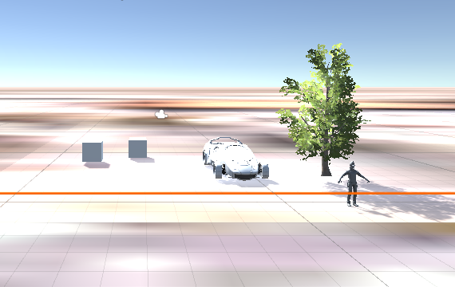
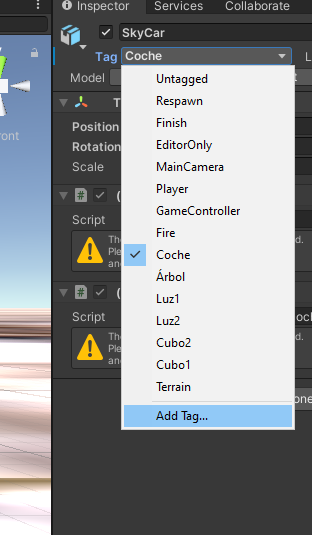
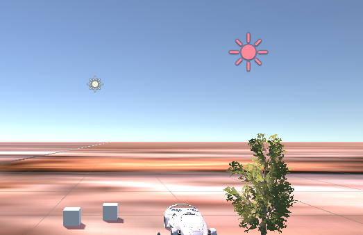
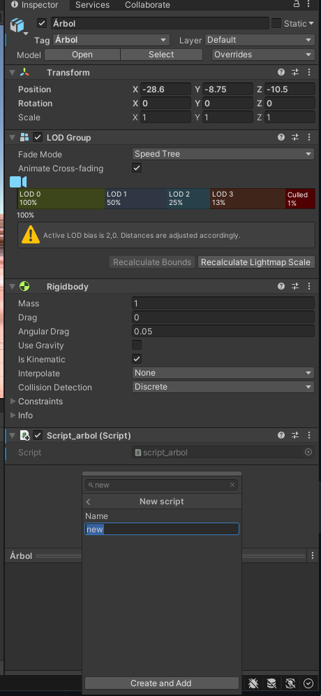
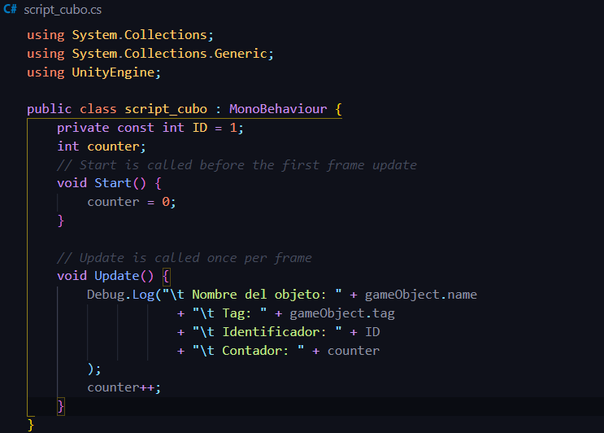
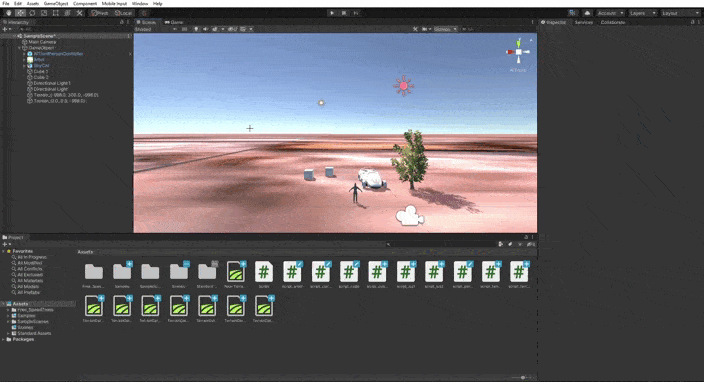

# Práctica 1

## Introducción a Unity

* Autor: Sergio de la Barrera García
* Asignatura: Interfaces Inteligentes
* Centro: Universidad de La Laguna

### Para realizar la práctica es necesario realizar lo siguiente

* Incluir objetos 3D básicos
* Incluir  algún objeto complejo de Standard Assets
* Incluir un objeto libre de la Asset Store que no sea de los Standard Assets
* Crear un terreno (opcional)
* Cada objeto debe tener una etiqueta que lo identifique
* La escena debe tener 2 fuentes de luz
* Utilizar prefabs de standard assets para un FPS o Third Person
* Agregar un script que escriba en la consola los objetos que se han utilizado, un identificador numérico que le asignes a cada uno de los objetos  y el valor de un contador que se actualiza en cada iteración para cada objeto

## 1. Incluir objetos 3D básicos

Para incluirlos debemos ir a Unity, en la barra superior `GameObjetc/3D Object/Cube`. En este caso utilizamos 2 cubos

Quedando de la siguiente manera

## 2. Incluir algún objeto complejo de Standard Assets

Para ello nos fijamos en la pestaña de abajo *Project* y vamos a `Standard Assets/Vehicles/Car/Prefabs` para utilizar, en este caso, un coche

Y lo arrastramos hasta nuestra escena

## 3. Incluir un objeto libre de la Asset Store que no sea de los Standard Assets

En este caso vamos a ir a la Asset Store de unity (*<https://assetstore.unity.com/>*), nos logueamos y escogemos el objeto que más nos guste

Para ello le damos a *Add to My Assets*

Y una vez añadido podemos importarlo a nuestro entorno unity y utilizarlo. En nuestro caso escogemos un árbol. Nos dirigimos a la pestaña de *Project* anterior y debería aparecernos lo siguiente

Una vez encontrado en la ruta `Assets/Free_SpeedTrees` ya podemos arrastralo hacia nuestra escena y de esta manera utilizarla

## 4. Creación de un terreno

En este caso, al ser la primera práctica y no tener conocimiento previo, hemos optado por hacer un terreno muy básico. Para ello, iremos a `GameObject/3D Object/Terrain`

Una vez creado puedes modificar distintos parámetros de él

Tras dejarlo como queremos, este ha sido el resultado:

## 5. Etiquetado de objetos

Para crear etiquetas de objetos, nos dirigimos al panel derecho tras haber pulsado un objeto previamente. En el apartado *Inspector* justo debajo del nombre encontramos la opción para etiquetar el objeto y crear nuevas etiquetas. Dicho esto pulsamos sobre *Add Tag*

Una vez pulsado, veremos un símbolo `+` con el cual iremos añadiendo las etiquetas necesarias para cada objeto dándole a `Save`. Hecho esto, ya solo queda etiquetar cada uno de los objetos con los *tags* creados como lo estaba el coche en la imagen anterior

## 6. Colocando fuentes de luz

Como requisito necesario para esta práctica es incorporar 2 fuentes de luz. Lo primero que haremos será ir a `GameObject/Light` y escoger entre las diferentes opciones, en este caso escogemos `Directional Light`

Una vez más nos dirigimos al panel de las izquiera donde podemos encontrar diferentes opciones para cambiar las fuentes de luz a tu gust. Nosotros vamos a cambiar el color tal y como se ve la imagen (color rojo claro y amarillo para la otra fuente)

Por último, colocamos las fuentes de luz según nos convenga

## 7. Utilización de prefabs de standard assets para Third Person

Tal y como hemos hecho en los anteriores casos vamos a la parte de abajo y nos dirigimos a la ruta `Assets/Standard Assets/Characters/ThirdPersonCharacter/Prefabs` y allí escogemos el que más nos guste

Una vez escogido el que queremos lo arrastramos a nuestra escena

## 8. Creación de scripts para objetos

Para añadir scripts a nuestros objetos es necesario tener selccionado uno y en la zona de la derecha, al final del todo encontramos una opción que dice `Add Component`. Una vez pulsado, escribimos new script, seleccionamos el nombre que queramos poner y pulsamos en `Create and add`

En esta práctica era necesario que se mostrara por consola lo siguiente:

* Los objetos utilizados
* Un identificador numérico del mismo
* Un contador que se actualiza en cada iteración para cada objeto
  
Este es un ejemplo del código de uno de los objetos

> *tened en cuenta los tabuladores para que la información se vea más clara*

Hecho esto, al ejecutar el juego veremos por consola todo lo que le hemos dicho que muestre

Finalmente la práctica ya está hecha

## 9. Resultados

A continuación os mostramos un pequeño gif del juego con su ejecución

> *Nótese que el personaje tiene movimiento pero no pude hacer que se moviera en distintas direcciones con las flechas*