Cuestionario #04: Lenguajes regulares y autómatas finitos (Tema 2)# Práctica 2

## Introducción a los scripts en Unity

* Autor: Sergio de la Barrera García
* Asignatura: Interfaces Inteligentes
* Centro: Universidad de La Laguna

## 1. Crear una escena simple sobre la que probar diferentes configuraciones de objetos físicos en Unity. La escena debe tener un plano a modo de suelo, una esfera y un cubo

###  a) Ninguno de los objetos será físico

Añadimos los objetos y al no tener físicas se quedarán estáticos

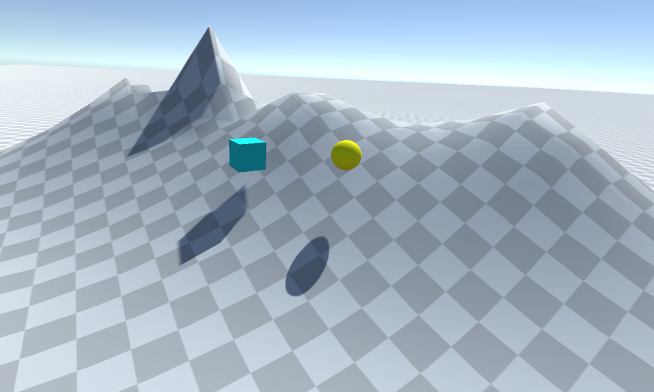

### b) La esfera tiene físicas, el cubo no

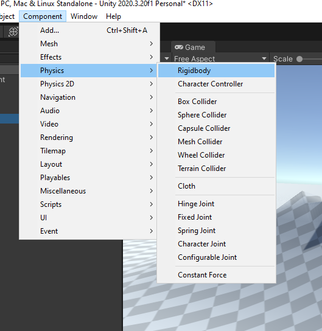

Una vez añadidas las físicas, podemos ver en el panel derecho como nos ha  añadido el componente

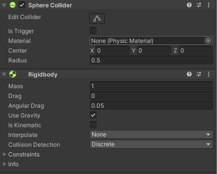

Y una vez le damos a jugar, veremos como la esfera tiene movimiento y el cubo se queda estático

### c) La esfera y el cubo tienen físicas

Hacemos lo mismo que anteriormente pero esta vez con el cubo y este es el resultado

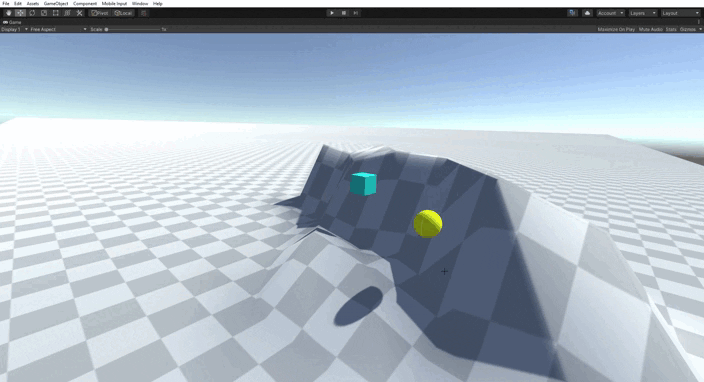

### d) La esfera y el cubo son físicos y la esfera tiene 10 veces la masa del cubo

Añadimos más masa a la esfera en el panel derecho del objeto en sus configuraciones en el apartado *Rigibody*. Allí veremos una casilla llamada *Mass* e introducimos el valor que queremos, en este caso 10

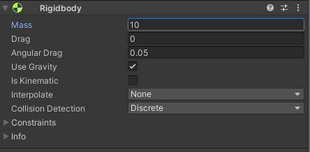

Una vez hecho esto, comprobamos si funciona y podemos ver como la esfera es capaz de desplazarlo

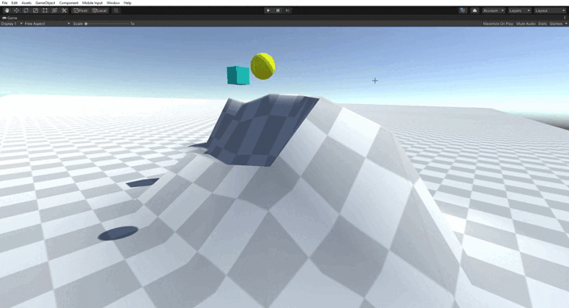

### e) La esfera tiene físicas y el cubo es de tipo IsTrigger

En este caso iremos al panel derecho del cubo, al componente *Box Collider* y activamos la opción *Is Trigger*

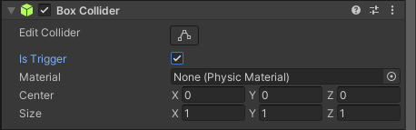

A continuación vemos como el cubo es capaz de ser atravesado por la esfera

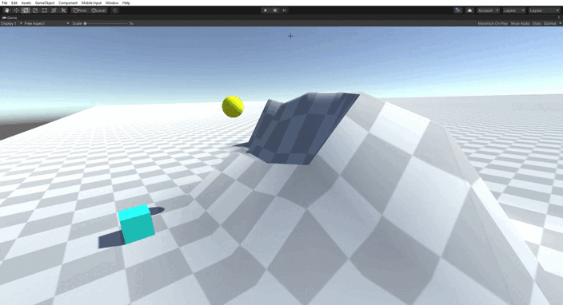

### f) La esfera tiene físicas, el cubo es de tipo IsTrigger y tiene físicas

Ahora vemos como el cubo es capaz de atravesar el terreno y caerá al infinito

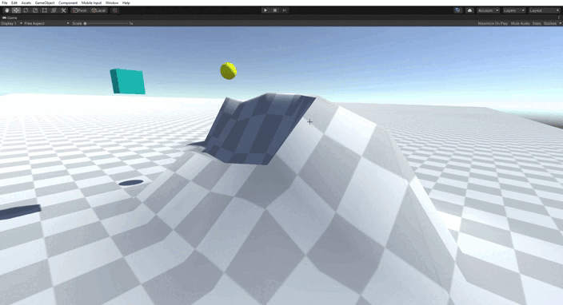

### g) La esfera y el cubo son físicos y la esfera tiene 10 veces la masa del cubo, se impide la rotación del cubo sobre el plano XZ

Para hace esto vamos al apartado *Ridigbody* del cubo, en la pestaña *Constraints* veremos la opción *Freeze Rotation*, elegimos los ejes X y Z para impedir que roten

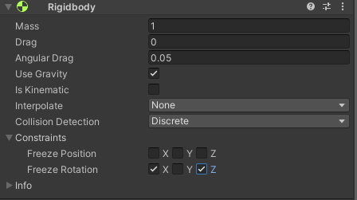

Además vemos que la esfera tiene 10 veces la masa del cubo

Vamos a ver la diferencia con dos gifs:

- Cuando no se impide la rotación

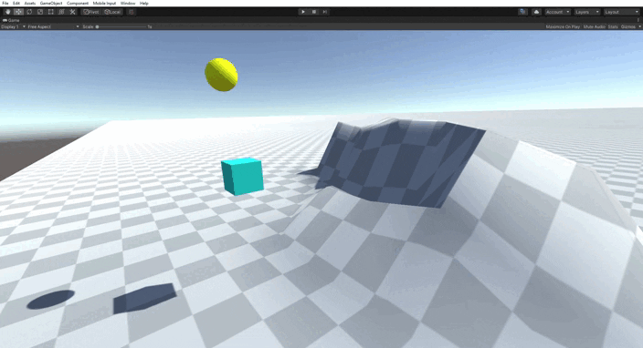
- Cuando se impide la rotación

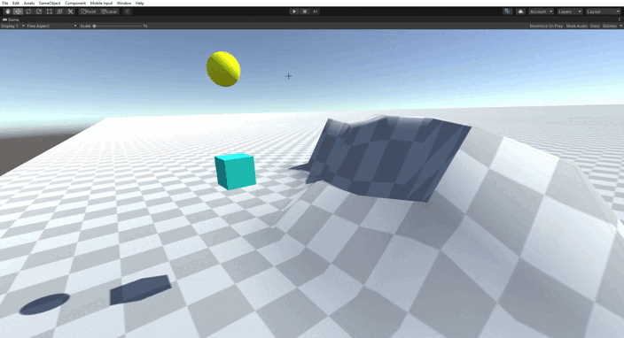

## 2. Sobre la escena que has trabajado ubica un cubo que represente un personaje que vas a mover. Se debe implementar un script que haga de CharacterController

Cuando el jugador pulse las teclas de flecha (o aswd) el jugador se moverá en la dirección que estos ejes indican.

### a) Crear un script para el personaje que lo desplace por la pantalla, sin aplicar simulación física

Crearemos una carpeta en *Assets* que se llame *Scripts* y crearemos un fichero *Csharp*

Este script tendrá lo siguiente

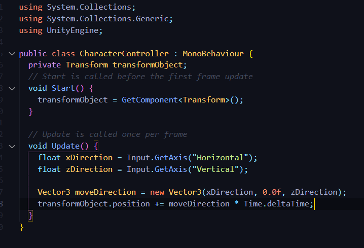

### b) Agregar un campo público que permita graduar la velocidad del movimiento desde el inspector de objetos

Para acceder al atributo *speed* hay que añadirlo como un atributo público de esta forma

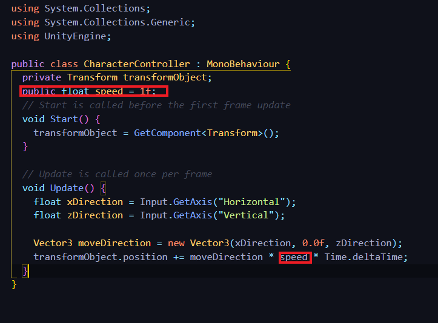

Ahora podemos ver como nos aparece en el panel derecho para modificarlo (acabó siendo modificada a 1)

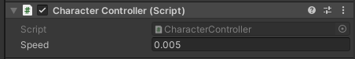

### c) Estar a la escucha de si el usuario ha utilizado los ejes virtuales. Elegir cuáles se va a permitir utilizar: flechas, awsd.

Realizado con los pasos anteriores

### Comprobamos su funcionamiento

Observamos que funciona perfectamente usando tanto las flechas como las teclas aswd para desplazarnos

### d) Elegir otros ejes virtuales para el giro y girar al jugador sobre el eje OY (up)

En este caso añadiremos dos teclas para poder rotar el objeto que serán la E y la Q, a su vez le hemos añadido el atributo speedRotation para modificar la velocidad en Unity

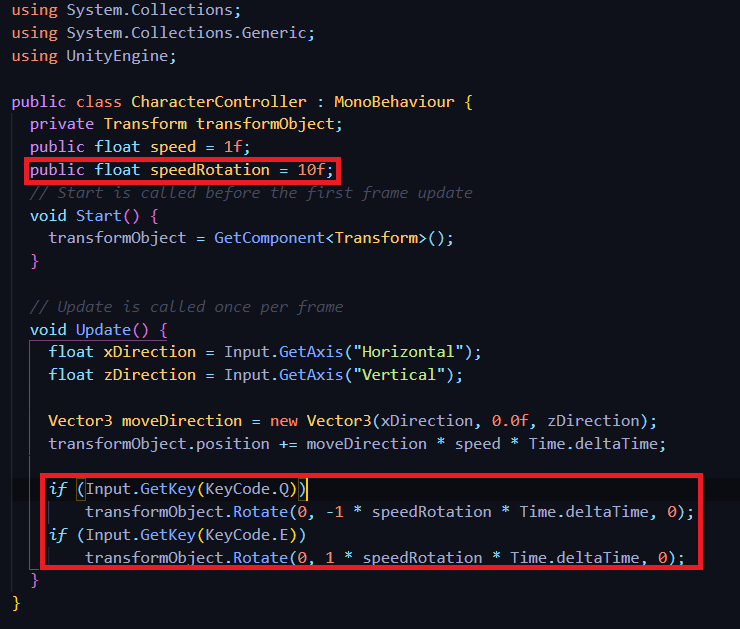

Así es el resultado final

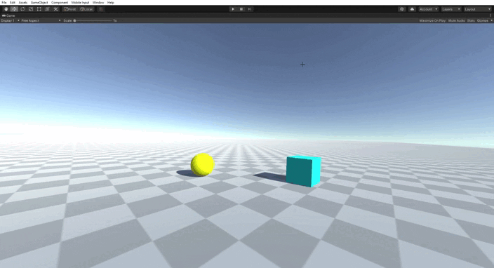

## 3. Sobre la escena que has trabajado programa los scripts necesarios para las siguientes acciones:

### * Se deben incluir varios cilindros sobre la escena. Cada vez que el objeto jugador colisione con alguno de ellos, deben aumentar su tamaño y el jugador aumentar puntuación

Para este apartado usaremos el método *OnCollisionEnter* en el que detectaremos el objeto con el que colisionan los cilindros que en este caso será el cubo. Una vez sepamos que colisiona aumentaremos su tamaño. Para ello también usaremos *transform.localScale()*

### * Se deben incluir cilindros que se alejen del jugador cuando esté próximo

Usaremos un método de Vector3 que se llama *Distance* para saber la diferencia de distancia que hay entre un objeto y otro.

Una vez sabemos esta diferencia de distancia calculamos la dirección y luego le indicamos con el *Translate* su movimiento.

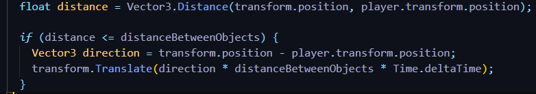

Como vemos no llega a tocar nunca el cilindro

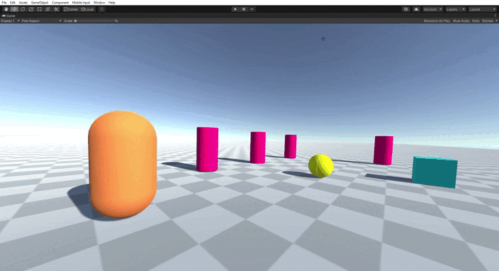

### * Ubicar un tercer objeto que sea capaz de detectar colisiones y que se mueva con las teclas: I, L, J, M

Para este apartado haremos un script indicándole las teclas que queremos que pulse el usuario para poder manejarlo con el método `Input.GetKey(KeyCode.I)` como vemos a continuación

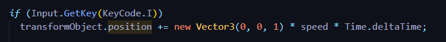

Vemos en el gif cómo funciona

/*faltan apartados*/