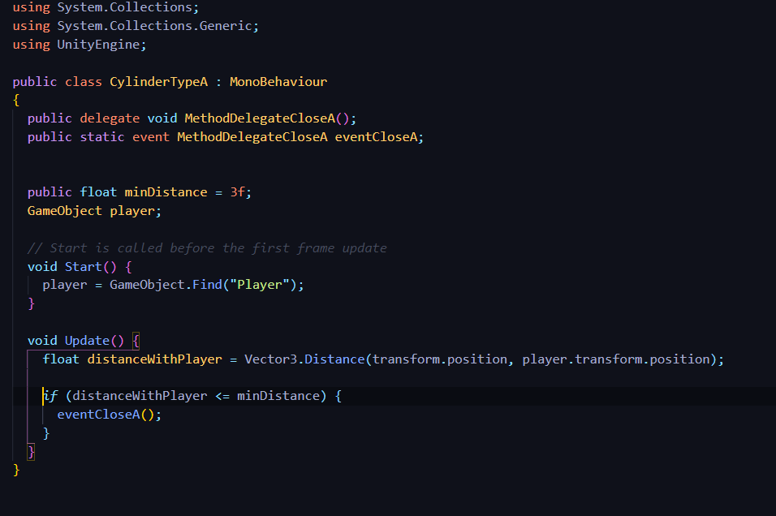
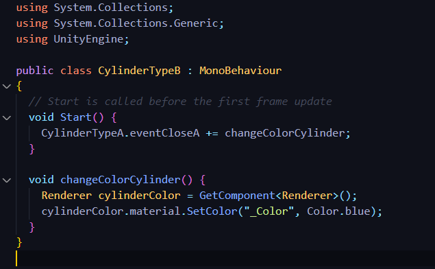
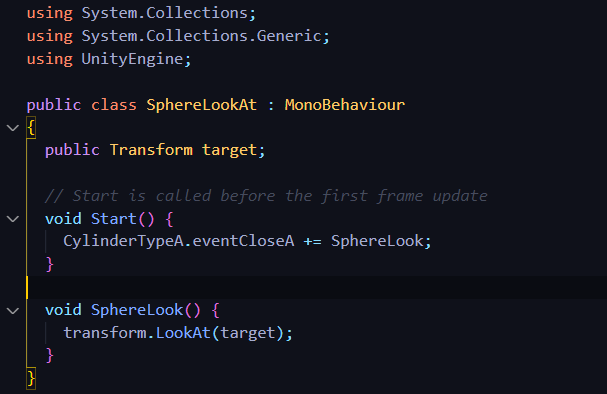
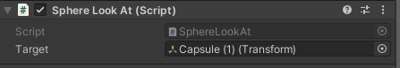
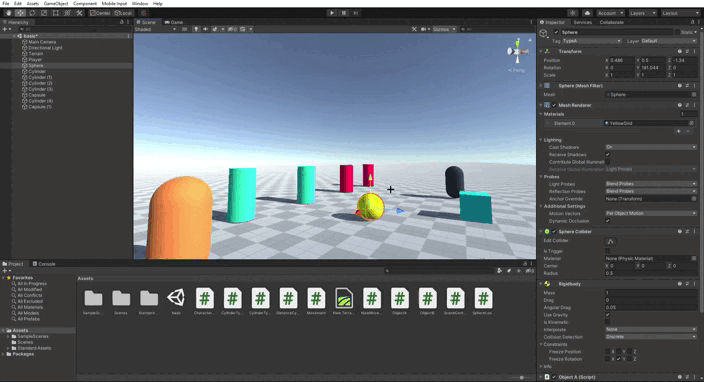
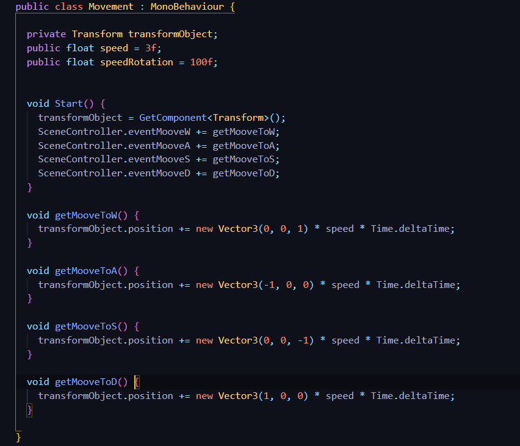
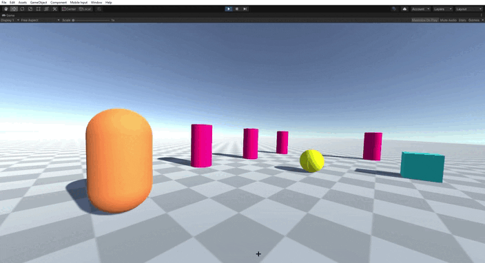

## Introducción a los scripts en Unity

* Autor: Sergio de la Barrera García
* Asignatura: Interfaces Inteligentes
* Centro: Universidad de La Laguna

## 1. Cuando el jugador colisiona con un objeto de tipo B, el objeto A mostrará un texto en una UI de Unity. Cuando toca el objeto A se incrementará la fuerza del objeto B

Para este ejercicio se ha puesto la Esfera(amarillo) como objeto de tipo B y la capsula (naranja) como objeto de tipo A. Se crearán los métodos delegados junto con sus eventos que se ejecutarán cuando haya una colisión

En el primer caso del ejercicio vemos como en el código del objeto A tenemos un método llamado *MessageCollision()* que será el que se ejcute cuando se active el evento y enviará el mensaje de que el jugador ha colisionado con el objeto B

En el segundo caso veremos en el código del objeto B el método llamado *sumCounterByCollisionPlayerWithA()* que será el que se ejecute cuando se active el evento de que el jugador ha colisionado con el objeto A, este método lo que hará será incrementar el valor de un contador (fuerza) y mostrarlo

Código Objeto A:

Código Objeto B:

Como podemos ver en el siguiente GIF cuando golpea el objeto de tipo A, el B incrementa la fuerza y luego al golpear el objeto de tipo B, el A envía un mensaje de que se ha golpeado al B

## 2. Cuando el jugador se aproxima a los cilindros de tipo A, los cilindros de tipo B cambian su color y las esferas se orientan hacia un objetivo ubicado en la escena con ese propósito

Para hacer esto creamos el método delegado y el evento *eventCloseA*. A continuación creamos la distancia mínima y el objeto *player*. Al inicio buscamos el player y en el update() creamos el vector3 de distancia del cylindroA con el jugador. Además si nos acercamos salta el evento

Luego en el cylindroB creamos el siguiente script para que cambie de color al ejecutarse el evento

Ahora para que la esfera se oriente hacia el objeto utilizamos *LookAt*

Esto hace que se cree un target en el inspector de la esphera, y solo tenemos que indicar cuál va a ser ese objeto target

Ahora vamos a ver el funcionamiento con un gif.

Los cylindros tipo A son los de color tuquesa y los tipo B son los de color rojo/rosa. El objeto target es la cápsula de color negro. Nótese la dirección de la esfera amarilla al incio y al final de gif con las flechas de movimiento. Además de cómo cambian a color azul oscuro los cylindros tipo B

## 3. Implementar un controlador que mueva el objeto con wasd

Lo primero que haremos será tener un script que añadiremos a la cámara principal llamado *SceneController* que tendrá el método delegado y varias condiciones para que cuando el usuario pulse cualquier tecla de las de movimiento se active el evento correspondiente

Después de esto crearemos otro fichero llamado *Movement* que se lo pondremos al objeto player.

En dicho fichero inicializamos el transform para mover el objeto y los eventos a la escucha

Por último, creamos los métodos que se ejecutarán al activarse el evento y de esta manera poder mover el objeto

Como podemos ver en el gif el objeto player se mueve igual que antes pero esta vez a través de un controlador

