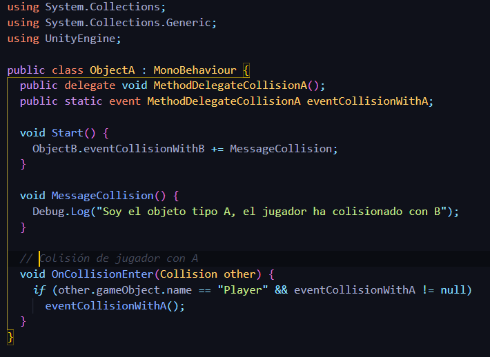
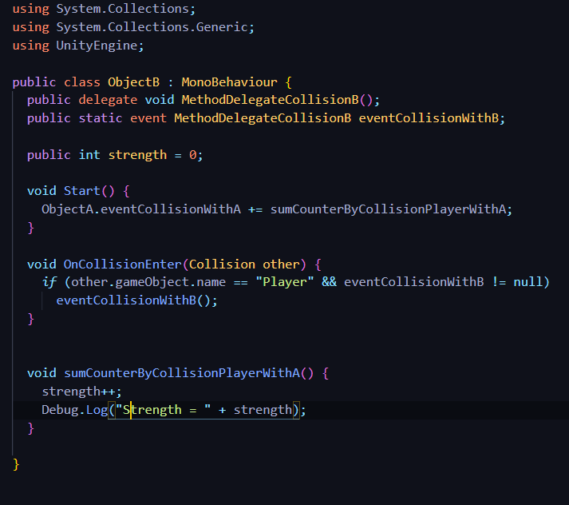
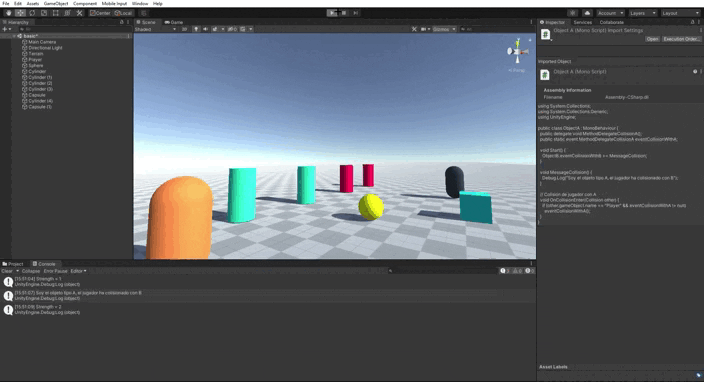
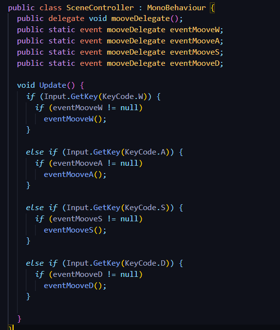

## Introducción a los scripts en Unity

* Autor: Sergio de la Barrera García
* Asignatura: Interfaces Inteligentes
* Centro: Universidad de La Laguna

## 1. Cuando el jugador colisiona con un objeto de tipo B, el objeto A mostrará un texto en una UI de Unity. Cuando toca el objeto A se incrementará la fuerza del objeto B

Para este ejercicio se ha puesto la Esfera(amarillo) como objeto de tipo B y la capsula (naranja) como objeto de tipo A. Se crearán los métodos delegados junto con sus eventos que se ejecutarán cuando haya una colisión.

En el primer caso del ejercicio vemos como en el código del objeto A tenemos un método llamado *MessageCollision()* que será el que se ejcute cuando se active el evento y enviará el mensaje de que el jugador ha colisionado con el objeto B.

En el segundo caso veremos en el código del objeto B el método llamado *sumCounterByCollisionPlayerWithA()* que será el que se ejecute cuando se active el evento de que el jugador ha colisionado con el objeto A, este método lo que hará será incrementar el valor de un contador (fuerza) y mostrarlo.

Código Objeto A:

Código Objeto B:

Como podemos ver en el siguiente GIF cuando golpea el objeto de tipo A, el B incrementa la fuerza y luego al golpear el objeto de tipo B, el A envía un mensaje de que se ha golpeado al B.

## 2. Cuando el jugador se aproxima a los cilindros de tipo A, los cilindros de tipo B cambian su color y las esferas se orientan hacia un objetivo ubicado en la escena con ese propósito

Falta por hacer

## 3. Implementar un controlador que mueva el objeto con wasd

Para ello utilizamos lo visto en prácticas anteriores. Y nos queda el siguiente código:

