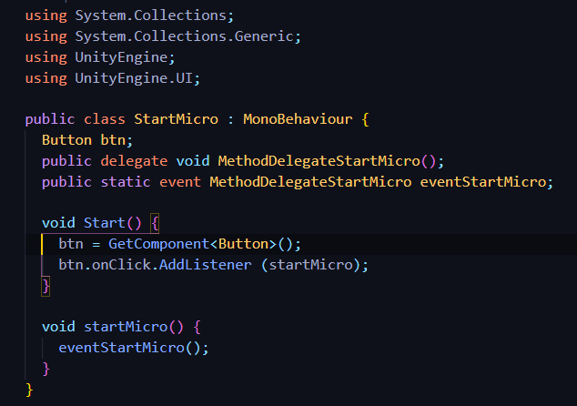
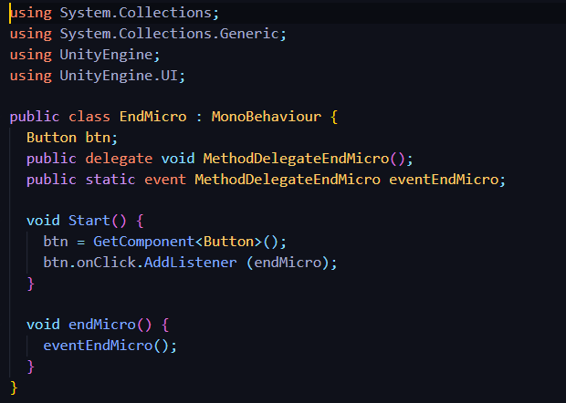
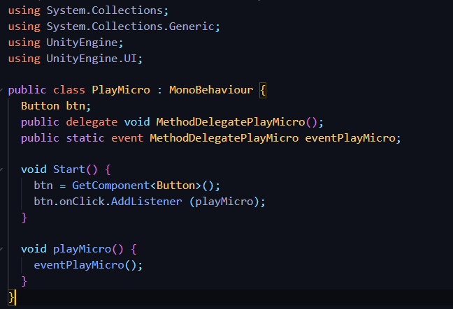
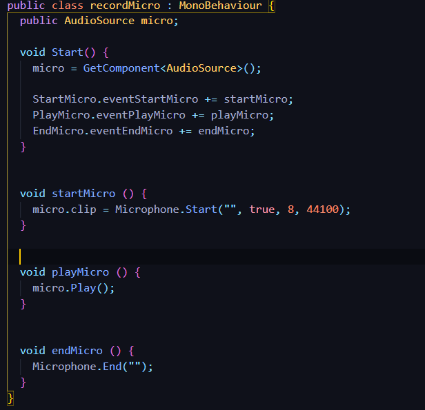
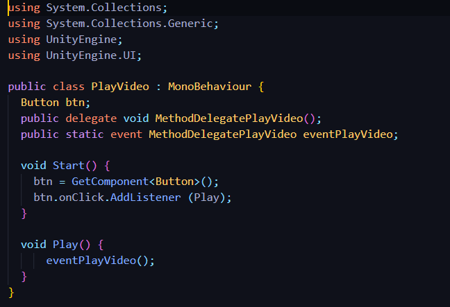
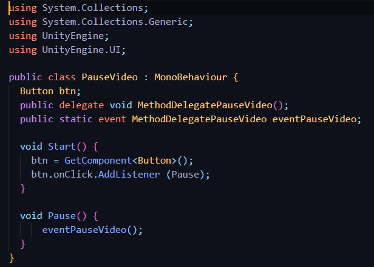
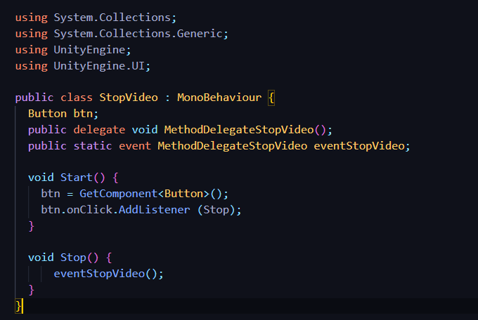
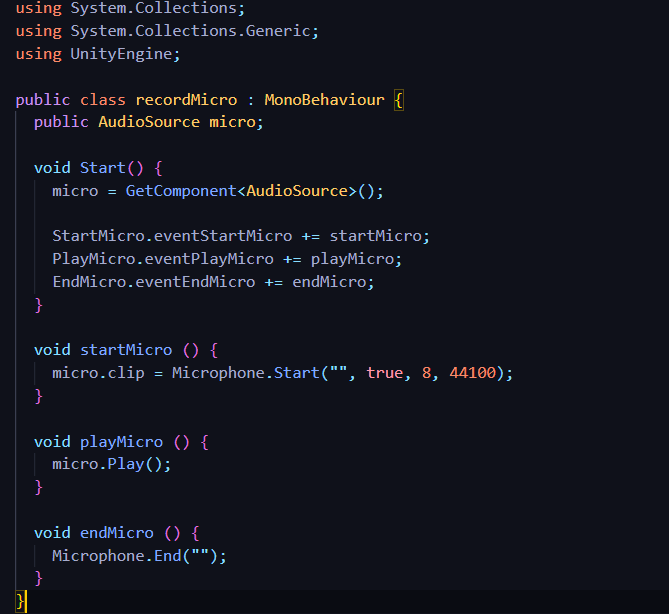
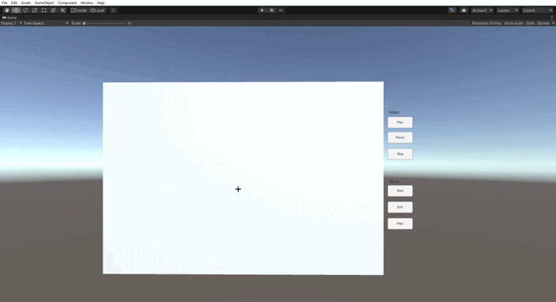

# Interfaces multimodales

* Autor: Sergio de la Barrera García
* Asignatura: Interfaces Inteligentes
* Centro: Universidad de La Laguna

## Objetivo de la práctica

El objetivo de esta práctica es practicar el uso de componentes con *Unity3D*. Los componentes que se van a ver en esta práctica son la cámara y el micrófono del ordenador o el teléfono móvil

Como norma general, para la utilización de estos componentes se debe importar el paquete UnityEngine. Hay que tener en cuenta que al probarse en el ordenador, muchos de los componentes pueden devolver datos no realistas o directamente no funcionar

## Micrófono

Para este apartado usaremos el componente Microphone que tendrá 3 métodos que son:

* Start : Empieza la grabación
* End : Termina la grabación
* Play : Reproduce lo que hemos grabado

Se han creado 3 botones para cada una de las funciones de este componente. Luego hemos añadido un objeto llamado AudioSource que será el que reciba la acción que hemos indicado al pulsar un botón y la ejecutará

### ¿Cómo lo hemos hecho?

Tenemos la siguiente estructura de ficheros:
* Audio
  * Buttons
    * StartMicro.cs: Script para empezar a grabar el audio
    * EndMicro.cs: Script para botón de parar la grabación
    * PlayMicro.cs: Script para botón de escuchar el audio grabado
  * recordMicro.cs:  Script para el objeto *AudioSource* que estará a la escucha de que botón se pulsa

Para hacer toda esta comunicación entre estos elementos usaremos tanto el método *onClick.AddListenner* de los botones y también se usarán *Delegados* para poder comunicar unos objetos con otros

### Códigos

Crearemos primero el código de los botones donde usaremos el método *onClick.AddListenner* y creando el evento delegate que será el que escuche el *Audiosource* para actuar

El código de los 3 botones es el mismo, solo cambia el nombre de los eventos y función

### Botón Start

### Botón End

### Botón Play

Una vez creados los botones con los eventos, crearemos el script para el objeto *Audiosource* que será el que esté atento a estos eventos y según el botón que se haya pulsado se ejecutará la función que le corresponde

### Record Micro

Con el método Microphone.Start haremos que detecte el micrófono por defecto y que grabe durante un tiempo de 8 segundos

## Cámara

En este caso usaremos el componente *WebCamTexture* que tendrá 3 métodos que son:

* Play : se inicia la cámara
* Pause : se para el video
* Stop : Para y termina el video

Se han creado 3 botones para cada una de las funciones de este componente. Luego hemos añadido un plano que hará de pantalla donde se reproducirá el video y este recibirá la acción que hemos indicado al pulsar un botón y la ejecutará

### ¿Cómo lo hemos hecho?

Tenemos la siguiente estructura de ficheros:

* Video
  * Buttons
    * PlayVideo.cs: Script para botón que empezará a usar la cámara
    * PauseVideo.cs: Script para botón de pausar la grabación
    * StopVideo.cs: Script para botón de terminar/parar el video
  * RecordVideo.cs: Script para el objeto plano que estará a la escucha de que botón se pulsa

Se ha programado de la misma forma que el caso del micrófono, usando el método *onClick.AddListenner* de los botones y también usando *Delegados* para poder comunicar unos objetos con otros

### Códigos

Crearemos primero el código de los botones donde usaremos el método onClick.AddListenner y creando el evento delegate que será el que escuche el plano que hará de pantalla para actuar según el botón que se pulse

El código de los 3 botones es el mismo, solo cambia el nombre de los eventos y función

### Botón Play

### Botón Pause

### Botón Stop

Una vez creados los botones con los eventos, crearemos el script para el objeto *plano* que será el que esté atento a estos eventos y según el botón que se haya pulsado se ejcutará la función que le corresponde

### Plano (que mostrará el vídeo)

En el método *Start* crearemos los componentes *WebCamTexture* y *Renderer*, uno para controlar la cámara y el otro para poder renderizar la imagen

## Ejemplo de funcionamiento

El uso de la cámara lo mostramos en el siguiente gif:

*Nótese que no se puede mostar el funcionamiento del micrófono pero ha funcionado correctamente y que al parar la cámara sigue manteniendo la imagen, pero la webcam deja de estar en uso*
