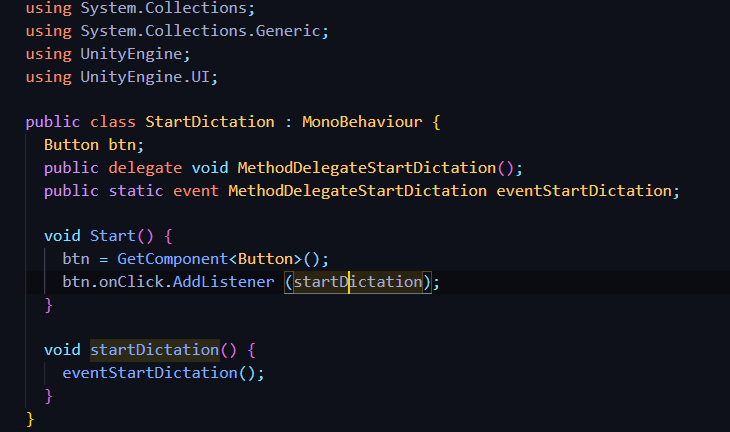
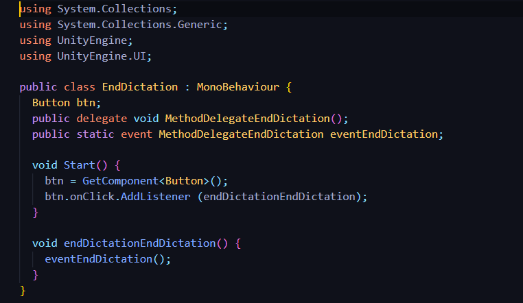
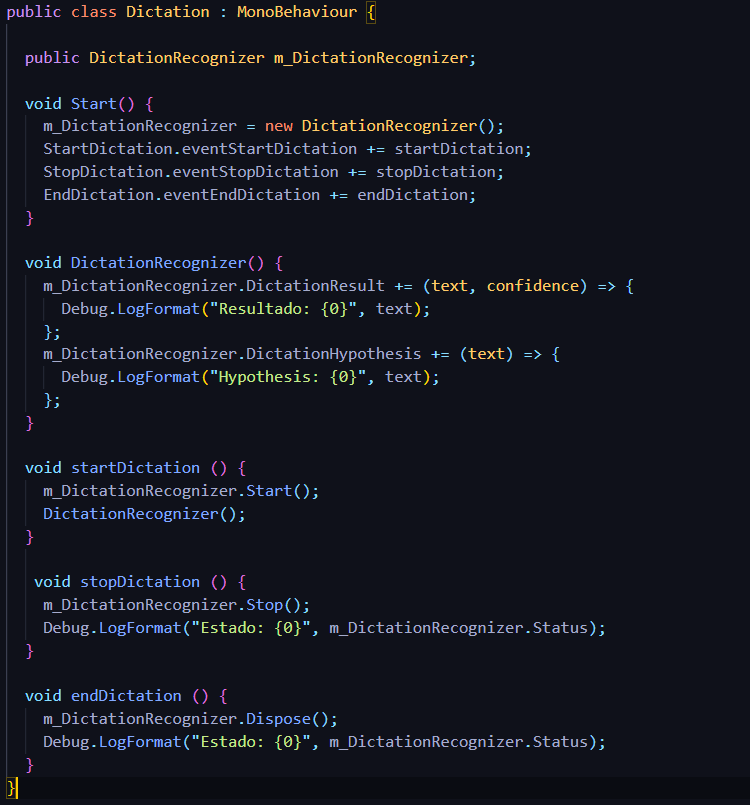
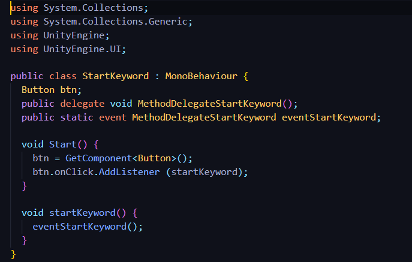
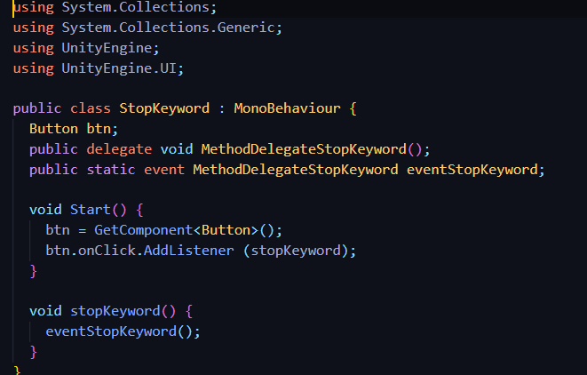
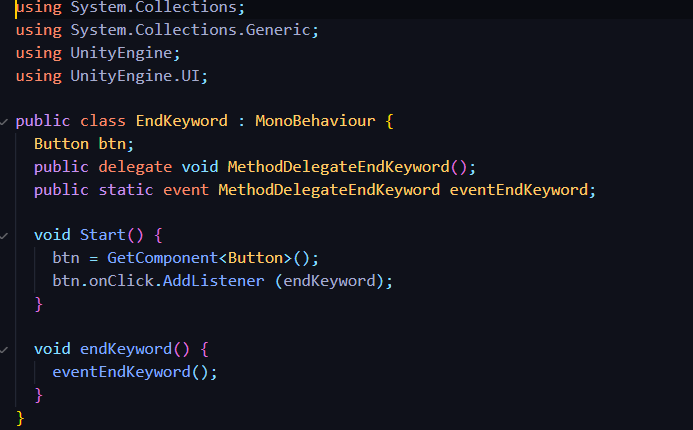
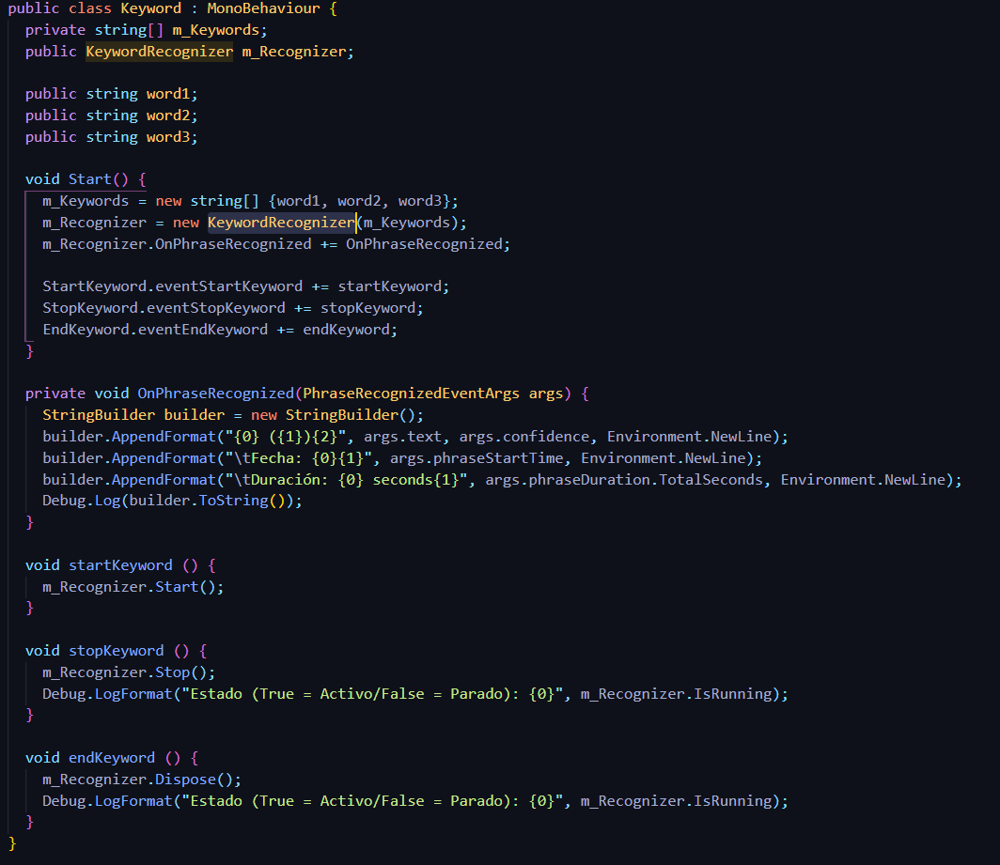
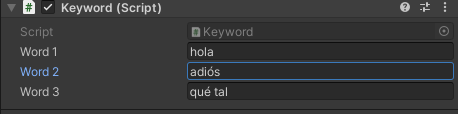
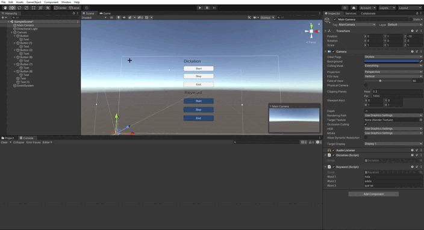
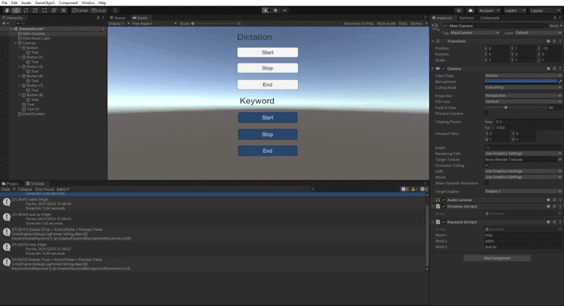

# Reconocimiento de Voz

* Autor: Sergio de la Barrera García
* Asignatura: Interfaces Inteligentes
* Centro: Universidad de La Laguna

## Objetivo de la práctica

El objetivo de esta práctica es aprender a utilizar las herramientas de
reconocimiento de voz que Unity3D ofrece para Windows 10. Para la utilización de estas
herramientas se debe importar el paquete UnityEngine.Windows.Speech. Hay que tener en
cuenta que este paquete sólo está disponible para el sistema operativo Windows 10

De este paquete utilizaremos las clases *DictationRecognizer* y *KeywordRecognizer*

### Uso de DictationRecognizer

Para hacer uso de este paquete creamos el componente Dication que tendrá 4 métodos:

- DictationRecognizer: Contiene la salida de información de las palabras reconocidas
- startDictation: Empieza el reconocimiento de palabras
- stopDication: Pausa el reconocimiento de palabras
- endDictation: Termina el reconocimiento de palabras

Se han creado 3 botones para controlar las funciones de este componente. Luego hemos aadido un objeto llamado DictationRecognizer que será el que reciba la acción al pulsar un botón y la ejecutará

### ¿Cómo lo hemos hecho?

Tenemos la siguiente estructura de directorios y ficheros:

- DictationRecognizer
  - Buttons
    - StartDictation: Script para empezar el reconocimiento
    - StopDictation: Script para pausar el reconocimiento
    - EndDictation: Script para finalizar el reconocimiento
  - Dictation.cs: Script para el objeto DicationRecognizer que estará a la escucha de los botones

Para hacer toda la comunicación entre los elementos usaremos tanto el método *onClick.AddListenner* de los botones y también se usarán *Delegados* para poder comunicar unos objetos con otros

### Código

Creamos el código de los botones donde usaremos el método ya mencionado *onClick.AddListenner* y creando el evento delegate que será el que escuche el 
*DictationRecognizer* para actuar

El código de los 3 botones es el mismo, solo cambia el nombre de los eventos y su función

### Botón Start

### Botón Stop

### Botón End

Una vez creados los botones con los eventos, creamos el script para el objeto *DictationRecognizer* que será el que esté atento a estos eventos y que según el botón que presionen se ejecutará la función que le corresponde

### Dictation

### Uso de KeywordRecognizer

En este caso usaremos el componente *KeywordRecognizer* que tendrá 4 métodos que son:

- OnPhraseRecognized: Contiene la salida de información de las Keywords
- startKeyword: Empieza el reconocimiento de Keywords
- stopKeyword: Para el reconocimiento de Keywords
- endKeyword: Finaliza el reconocimiento de Keywords

Se han creado 3 botones para cada una de las funciones de este componente. Luego hemos añadido un objeto llamado KeywordRecognizer que será el que reciba la acción que hemos indicado al pulsar un botón y la ejecutará

### ¿Cómo lo hemos hecho?

Tenemos la siguiente estructura de ficheros:

- KeywordRecognizer
  - Buttons
    - StartKeyword: Script para empezar el reconocimiento
    - StopKeyword: Script para pausar el reconocimiento
    - EndKeyword: Script para finalizar el reconocimiento
  - Keyword.cs: Script para el objeto KeywordRecognizer que estará a la escucha de los botones

Para hacer toda esta comunicación entre estos elementos usaremos tanto el método *onClick.AddListenner* de los botones y también se usarán *Delegados* para poder comunicar unos objetos con otros

### Códigos

Crearemos primero el código de los botones donde usaremos el método onClick.AddListenner y creando el evento delegate que será el que escuche el plano que hará de pantalla para actuar según el botón que se pulse

El código de los 3 botones es el mismo, solo cambia el nombre de los eventos y función

### Botón Start

### Botón Stop

### Botón End

### Keyword

Para las Keyword almacenamos cada palabra en un vector de strings y utilizamos variables públicas de tipo string, en este caso 3 y se pueden poner la palabras que uno quiera en el panel de la derecha

### Ejemplo de funcionamiento

- Keyword

Probamos a decirle las keywords y las reconoce sin ningún problema

- Dictation

Hablamos y nos reconoce las palabras sin problema

